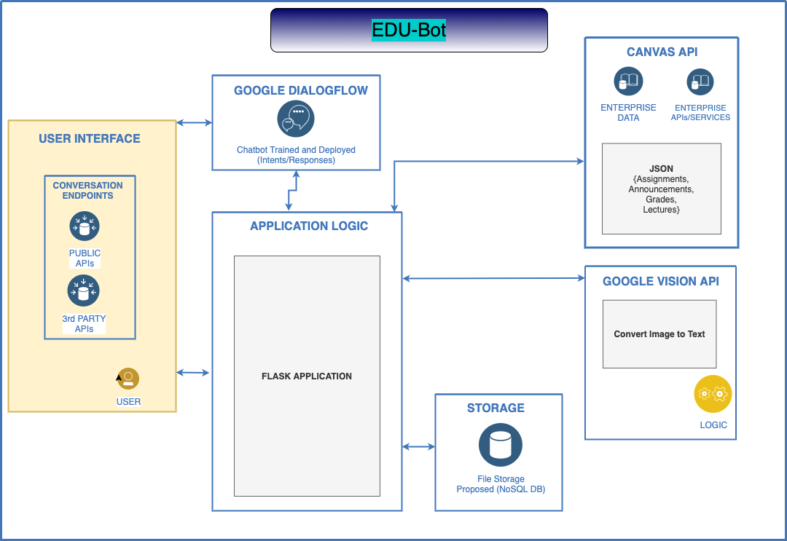
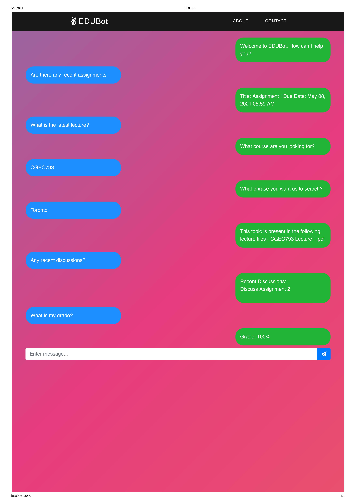

## EDUBOT Application
* EDUBot is an educational chatbot that helps students navigate through everything in their canvas classroom. This includes having the ability to search for a phrase through all the lecture notes, whether they’re handwritten notes or a pdf uploaded by the prof. The student also has the ability to pull the latest announcements, discussion posts, lecture notes, and grades using the power of natural language processing!
* Firstly, clone this entire repository. Then, follow either the project setup instructions below

## Team Members
* Wrichiek Kar
* Hamza Mohiuddin
* Neel Bhavsar
* Rinay Shah

## Tools and Technologies 
* Web Framework used: Flask 
* Machine Learning: Natural Language Processing, Google Vision

## External API's
* Google DialogFlow API for NLP Chatbot
* Google Vision API for converting handwriting/pdf to text
* Canvas API to pull course data from

## Project Setup Instructions
1. Run pip install -r requirements.txt
2. Download ngrok to locally host the flask project, select port 5000
3. Add in your canvas access code in credentials.yaml
4. Add in your google tokens in script.py and index.py
5. Add Flask Environment Variables (.flaskenv)
6. Run “flask run” and start talking!

## Architecture 

## Sample Conversation

# Devpost Submission

* Project name
EDUBot
* Elevator pitch 
Educational platforms like E-learning, D2L and Canvas are not the best and complicated as heck, especially if you want to find some lectures or assignments! Don’t you wish you could just ask and receive?? Well now you can! Thanks to EDUBot you can literally ask “Where is the section on magnetic flux” and EDUBot will find it for you from all the available content for the course, including your prof’s hand written notes! EDUBot also has the ability to pull your grades, assignments, announcements, and discussion posts!

* About the project
Be sure to write what inspired you, what you learned, how you built your project, and the challenges you faced. Format your story in Markdown.

## Inspiration 
- Engineering is hard. Profs post 50- 80 page ppts a week and it's very difficult and time consuming to look through it all. As an engineering student, we do not have time to skim through everything everytime we want to study a specific topic. EDUBot can help with that :) 

## What We Learned 
- We learned that, getting all separate parts of a project is easy, but integrating it all together is the most time consuming and important part of the project, a good chunk of time should be allotted to this. We definitely would’ve been less stressed if we accounted for this. 

## How we built the project

## Description
This Educational Chatbot uses Google Dialogflow to help students find the right Lecture Notes, Grades, Assignment, Announcements and Discussions with a phrase input. 

<b> Tools and Technologies </b>
* Web Framework used: Flask 
* Machine Learning: Natural Language Processing, Google Vision

<b>External API's </b>
* Google DialogFlow API for NLP Chatbot
* Google Vision API for converting handwriting/pdf to text
* Canvas API to pull course data from

## Challenges We Faced
- Handwriting conversion is difficult to find. A nice good one, after multiple attempts we settled on google vision API. 
- Combining all different aspects of the project together from different developers with different styles is very difficult. Lots of modifications need to be made, and the difficulty was multiplied due to the fact that we’re virtual. 

